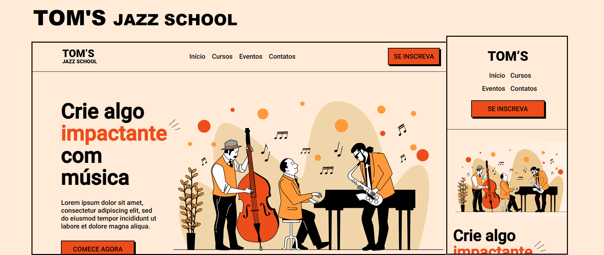

<h1 align="center"> Projeto Web 2! </h1>

Landing page para uma escola de música!

  <a  href="#-tecnologias">Tecnologias</a>&nbsp;&nbsp;&nbsp;|&nbsp;&nbsp;&nbsp;
  <a href="#-projeto">Projeto</a>&nbsp;&nbsp;&nbsp;|&nbsp;&nbsp;&nbsp;
  <a href="#-layout">Layout</a>&nbsp;&nbsp;&nbsp;|&nbsp;&nbsp;&nbsp;
  <a href="#memo-licença">Licença</a>

  

 

  

## 🚀 Tecnologias

Esse projeto foi desenvolvido com as seguintes tecnologias:

- HTML e CSS
- Git e Github
- Figma
- VS Code

## 💻 Projeto

Esta Landing page é um pequeno projeto Web, onde foram utilizados apenas HTML e CSS. Fora aplicada responsividade para diferentes tamanhos de telas.

## :memo: Licença

Esse projeto está sob a licença MIT.